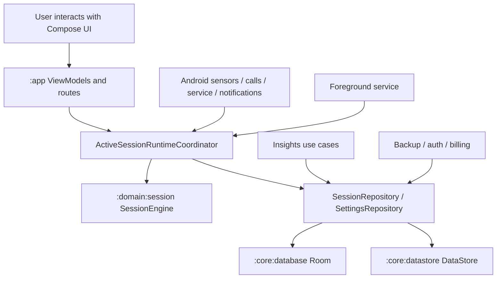

# Phone Down Architecture Guide

## 1. Purpose of This Document

This guide explains how Phone Down is architected today, why the system is split the way it is, and how the major product flows move through the codebase.

It is intentionally broader than `architecture.md`:

- `architecture.md` is the product and architecture master spec.
- This document is the implementation-facing guide for engineers working in the repository.

Use this guide when you need to:

- understand the module boundaries
- trace a focus session from button tap to persisted result
- see where Android-specific behavior lives
- understand which integrations are real vs fake/deferred
- onboard a new engineer or agent into the codebase safely

## 2. Product Architecture in One Sentence

Phone Down is a local-first Android focus app where a foreground service, sensor-validity monitor, and pure session engine work together so focus time only accumulates while the phone is face down and stable.

That sentence matters because it describes the three core architecture decisions:

1. local-first persistence
2. pure domain rules for session correctness
3. Android runtime orchestration at the app edge

## 3. Core Architectural Principles

The repository is built around a few non-negotiable principles.

### 3.1 Local First

The focus ritual must work without login, network access, billing, or cloud services.

That leads to this storage posture:

- Room stores session history and penalty events.
- DataStore stores user settings and app preferences.
- backup/auth/billing are optional extensions, not prerequisites for the timer.

### 3.2 Honest Session Semantics

The app should never pretend a session was cleaner or more complete than it really was.

This is why:

- session classification is handled in domain logic instead of UI
- interruptions are explicitly modeled
- recovery after app kill or reboot is conservative
- “clean” status is revoked permanently after meaningful interruptions

### 3.3 Pure Rules, Android at the Edge

The codebase deliberately separates product rules from Android wiring:

- `:domain:session` owns the session state machine
- `:app` translates Android events into domain inputs
- `:core:*` implementation modules hold platform integrations
- `:feature:*` modules stay UI-focused

This keeps the hardest logic testable without an emulator or device.

### 3.4 Calm UI, Strict Mechanism

The architecture supports strict timing and interruption rules, but the user-facing modules present them with neutral copy and minimal UI clutter.

That is why the design system is centralized and feature modules receive already-shaped state rather than embedding business policy in composables.

## 4. High-Level System Overview

At a high level, the app looks like this:

The important split is this:

- the UI asks for intent-level actions such as “start”, “pause”, “resume”, “add time”
- the coordinator converts runtime signals into domain inputs
- the domain engine decides the next legal session state
- repositories persist that state

## 5. Module Map

The repository uses a multi-module Gradle architecture.

### 5.1 Top-Level Modules

| Module | Responsibility |
|---|---|
| `:app` | Android app shell, activity, navigation, runtime coordinator, service wiring, permission flow |
| `:feature:focus` | Focus UI composables and presentation models |
| `:feature:insights` | Insights UI composables |
| `:feature:settings` | Settings and privacy-policy UI |
| `:feature:onboarding` | First-launch onboarding UI |
| `:feature:account` | Account and backup UI |
| `:feature:pro` | Pro/paywall UI |
| `:domain:session` | Pure session state machine and use cases |
| `:domain:insights` | Pure analytics aggregation use cases |
| `:core:model` | Shared domain models, enums, and repository contracts |
| `:core:common` | Shared primitives such as `Clock`, `IdGenerator`, secure random helpers |
| `:core:designsystem` | Theme tokens and reusable Compose primitives |
| `:core:database` | Room entities, DAOs, mappers, repository implementations |
| `:core:datastore` | DataStore-backed settings and caches |
| `:core:sensors` | SensorManager integration and semantic validity evaluation |
| `:core:notifications` | Foreground notification creation and sound/haptic playback |
| `:core:backup` | Backup schema, serialization, fake backup implementation |
| `:core:auth` | Fake auth implementation |
| `:core:billing` | Fake billing implementation |
| `:core:charts` | Shared charting primitives used by insights surfaces |

### 5.2 Dependency Direction

The intended dependency direction is documented in `docs/module-dependency-rules.md`.

The practical rule is:

- `:app` can depend on almost everything because it is the wiring layer
- `:feature:*` depends downward, never on `:app`
- `:domain:*` depends only on lightweight shared modules
- `:core:*` implementation modules should not depend on feature modules

This direction exists to prevent Android/UI details from leaking into the product rules.

## 6. Key Domain Models

Most business behavior hangs off a small set of shared models in `:core:model`.

### 6.1 Focus Session

`FocusSession` is the central record for a single focus attempt.

It carries:

- planned duration
- required duration
- valid focus seconds
- actual elapsed seconds
- penalty seconds
- interruption counters
- start/end timestamps
- current state
- final result
- clean/broken flags

Two duration values are intentionally tracked:

- `plannedDurationSeconds`: the original user-selected duration
- `requiredDurationSeconds`: the current completion threshold after add-time or policy changes

That distinction is what allows analytics to preserve the original intent while the runtime still enforces the real current target.

### 6.2 Session State

The session lifecycle currently uses states such as:

- `Created`
- `WaitingForPhoneDown`
- `Arming`
- `Active`
- `PausedByPickup`
- `PausedByCall`
- `PausedByUser`
- `Completed`
- `EndedEarly`
- `Invalidated`
- `Broken`
- `Abandoned`

The key idea is that the state machine is explicit rather than inferred from timers and booleans scattered across UI code.

### 6.3 Penalty Events

`PenaltyEvent` records interruptions and related events that need to survive beyond the in-memory runtime.

This gives the app:

- auditable interruption history
- analytics inputs for focus quality and trends
- honest reconstruction after process death or backup/restore

### 6.4 User Settings

`UserSettings` holds user preferences such as:

- default duration
- free-user custom duration limit
- sound enabled
- haptics enabled
- theme mode
- onboarding completion
- backup-related flags and metadata

## 7. Runtime Ownership Model

The most important architecture decision in the codebase is runtime ownership.

### 7.1 Who Owns What

| Layer | Owns |
|---|---|
| UI (`:feature:*`) | rendering and user intents |
| ViewModels / routes (`:app`) | state collection, intent forwarding, navigation |
| `ActiveSessionRuntimeCoordinator` | orchestration between runtime signals, session engine, and persistence |
| `SessionEngine` | legal state transitions and timer/interruption rules |
| repositories | persistence APIs |
| Android service/sensors/notifications | platform event production and background execution |

The coordinator is the bridge layer that prevents either side from taking on too much:

- the service does not implement timer rules
- the UI does not implement persistence cadence
- the domain engine does not depend on Android APIs

## 8. Focus Session End-to-End Flow

This is the most important product flow in the app.

### 8.1 Start Flow

1. The user taps Start from the Focus screen.
2. `FocusRoute` forwards the action up to the app shell.
3. `MainActivity` checks notification permission if needed.
4. `FocusSessionService.start(...)` is called.
5. The service asks `ActiveSessionRuntimeCoordinator.ensureSessionStarted(...)`.
6. `StartSessionUseCase` creates the initial `FocusSession`.
7. The initial session is persisted through `SessionRepository`.
8. The app enters `WaitingForPhoneDown`.

Why this is structured this way:

- Start permission handling is an Android concern, so it stays in `MainActivity`.
- Session creation is a domain concern, so it stays below the UI.
- Service startup is explicit because active focus must survive backgrounding.

### 8.2 Face-Down Arming Flow

1. `FocusSessionService` starts sensor collection through `FocusValidityMonitor`.
2. `AndroidFocusValidityMonitor` reads accelerometer, rotation vector, and proximity data.
3. `FocusValidityEvaluator` converts raw sensor snapshots into semantic validity output.
4. The coordinator receives `FocusValidityResult`.
5. When validity becomes physically acceptable, it emits `SessionInput.PhoneBecameValid`.
6. `SessionEngine` transitions from `WaitingForPhoneDown` to `Arming`.
7. After the required arming duration elapses, repeated ticks move the session into `Active`.

The arming period exists to prevent accidental starts when the phone is moving into position.

### 8.3 Active Timing Flow

Once active:

1. the service emits a `Tick` every second
2. the coordinator forwards `SessionInput.Tick` into the session engine
3. the engine increments valid focus time only when the session is in a legal active state
4. periodic persistence occurs through `SessionRepository`
5. the coordinator updates its `StateFlow`
6. the UI and notification both react to the same runtime state

This single-source-of-truth model is important because it reduces the chance that the timer shown in the UI diverges from persisted state.

### 8.4 Pickup / Interruption Flow

When the device stops being valid:

1. the sensor monitor emits a new invalidity result
2. the coordinator detects the physical-validity edge change
3. `SessionInput.PhoneBecameInvalid` is sent to the session engine
4. the engine transitions from `Active` to `PausedByPickup`
5. interruption timers and penalty logic begin
6. penalty events are persisted when thresholds are crossed

The interruption system is modeled as part of the state machine rather than as a separate timer overlay. That makes restoration and analytics much more trustworthy.

### 8.5 Pause / Resume / Add Time Flow

Phase 15 made these controls real rather than UI-only.

Current behavior:

- `Pause` sends `SessionInput.ManualPauseRequested`
- `Resume` sends `SessionInput.ManualResumeRequested`
- `Add Time` sends `SessionInput.AddTimeRequested(additionalSeconds)`

Important semantics:

- manual pause marks the session non-clean
- resume returns the session to `WaitingForPhoneDown`
- the user must complete the phone-down ritual again before active progress resumes
- add-time changes the actual required duration, not just the displayed timer

### 8.6 Completion and Ending Flow

Completion happens when valid focus time reaches `requiredDurationSeconds`.

Possible outcomes include:

- clean completion
- interrupted completion
- ended early
- invalidated
- broken
- abandoned

This distinction is essential for the honesty principle. A session ending is not the same thing as a session succeeding cleanly.

## 9. Session State Machine Responsibilities

The pure state machine lives in `domain/session/src/main/kotlin/phonedown/domain/session/SessionEngine.kt`.

### 9.1 What the Session Engine Decides

It owns:

- session creation
- arming transitions
- active timing accumulation
- interruption transitions
- call pause handling
- manual pause/resume handling
- add-time handling
- session completion
- early-end classification

### 9.2 What the Session Engine Does Not Decide

It does not own:

- Android service lifecycle
- sensor registration
- runtime permissions
- notification rendering
- navigation
- database implementation details

This is what makes the engine cheap to unit test and safe to evolve.

## 10. Sensor Architecture

Sensor correctness is one of the defining technical problems in Phone Down.

### 10.1 Why Sensor Logic Is Isolated

Raw sensor APIs are noisy and device-dependent. If that complexity leaks into the UI or service, correctness becomes hard to test and reason about.

So the repo keeps sensor logic in `:core:sensors`.

### 10.2 Current Sensor Inputs

The validity monitor uses:

- accelerometer
- rotation vector when available
- proximity sensor when available

The proximity sensor is not used as the sole “phone down” signal.

That is intentional:

- proximity only tells you whether something is near the sensor
- it cannot reliably tell you that the phone is face down on a table
- different devices place and tune the sensor differently
- a face-down rule needs orientation and stability, not just nearness

In practice:

- accelerometer and rotation data determine orientation and movement
- proximity is an additional contextual hint

### 10.3 Semantic Validity Output

Instead of exposing raw sensor values upward, `AndroidFocusValidityMonitor` publishes `FocusValidityResult`.

That result includes:

- `isValid`
- `reason`
- `stabilityState`
- optional confidence/movement data
- optional debug diagnostics

This is good architecture because higher layers can work in product-language terms like “face down stable” or “sensors unavailable” instead of sensor-math terms.

### 10.4 Debug Diagnostics

Debug builds can expose richer diagnostic information. This helps QA and tuning without polluting production UX.

## 11. Foreground Service Architecture

The focus runtime is intentionally hosted in a foreground service.

### 11.1 Why a Foreground Service Exists

Android will otherwise aggressively constrain background execution, especially for long-running timer + sensor work.

The foreground service gives the app:

- survivable active sessions while backgrounded
- a user-visible ongoing notification
- a place to host sensor, call, and tick loops

### 11.2 Service Responsibilities

`FocusSessionService` owns:

- startup actions (`start`, `retry`, `end`)
- long-running runtime loops
- sensor monitoring subscription
- call monitoring subscription
- one-second tick loop
- foreground notification lifecycle
- shutdown flushing

### 11.3 Service Shutdown Safety

On destroy, the service flushes session state with a timeout-protected synchronous write.

The tradeoff is deliberate:

- a little synchronous cleanup risk is accepted
- losing final session state at shutdown would be worse for trust

## 12. Runtime Coordinator Architecture

`ActiveSessionRuntimeCoordinator` is the operational heart of the app.

### 12.1 What It Does

It owns:

- current in-memory `SessionRuntime`
- latest sensor validity snapshot
- runtime recovery entry points
- translation from runtime signals to `SessionInput`
- persistence cadence
- notification text state
- sound/haptic feedback derivation
- service stop conditions

### 12.2 Why the Coordinator Exists

Without this layer:

- the service would become a business-logic blob
- the domain engine would need Android knowledge
- the UI might start doing timing math or persistence orchestration

The coordinator keeps those responsibilities separated.

### 12.3 Persistence Cadence

The coordinator does not persist on literally every tick.

Instead it persists when:

- state changes
- result changes
- interruption events occur
- broken flag changes
- enough active time has elapsed since the last write
- manual pause/resume/add-time operations happen

This is the classic tradeoff between storage churn and crash safety.

## 13. Persistence Architecture

Persistence is split between Room and DataStore.

### 13.1 Room in `:core:database`

Room stores durable history:

- focus sessions
- penalty events

Important implementation traits:

- enums are stored as stable strings
- both wall-clock and elapsed-realtime timestamps are stored
- repository methods support single-session updates and full data replacement

Using both time domains matters:

- wall-clock is useful for display and analytics windows
- monotonic elapsed time is safer for runtime timing correctness

### 13.2 DataStore in `:core:datastore`

DataStore stores:

- duration preferences
- sound/haptic/theme preferences
- onboarding completion
- backup metadata
- entitlement cache state

One intentionally odd detail: the DataStore filename remains `phone_down_theme_mode` for backward compatibility with earlier builds.

### 13.3 Repository Contracts

The pure contracts live in `:core:model`.

Key repository interfaces include:

- `SessionRepository`
- `SettingsRepository`
- `BackupRepository`
- `AuthRepository`
- `BillingRepository`

This is what allows the domain and app layers to remain mostly ignorant of Room/DataStore implementation details.

## 14. Recovery Strategy

Phone Down chooses an honesty-first recovery strategy.

### 14.1 Recovery Entry Points

Recovery can happen after:

- app relaunch
- unexpected foreground-service restart
- device reboot

### 14.2 Recovery Posture

The app does not optimistically assume an unfinished session should silently resume as if nothing happened.

Instead, recoverable persisted sessions are classified according to domain recovery rules.

That avoids a common trust problem in timer apps where the app “helpfully” invents continuity that never really existed.

## 15. Backup and Restore Architecture

Backup and restore are intentionally isolated from the core focus runtime.

### 15.1 Current State

Today the app has:

- a real backup data model and serializer
- a fake repository implementation
- a real local restore application path

That means the integration surface is real, but the cloud transport is still fake/deferred.

### 15.2 Backup Schema

The backup system serializes:

- sessions
- penalty events
- settings

The schema is versioned JSON, and stable enum strings are used instead of raw enum names to protect future compatibility.

### 15.3 Restore Semantics

Restore is full-replace, not merge.

That means:

1. fetch the restore payload
2. block restore if a live focus session is active
3. replace Room session and penalty data
4. restore settings

The tradeoff is simplicity and trust:

- merge logic is more ambiguous
- full replace is easier to explain and verify

### 15.4 Atomicity Limitation

Room and DataStore cannot be committed in one atomic transaction together.

Current practical choice:

- restore Room first
- restore settings second

This minimizes the worse failure mode, which would be restored settings with missing restored history.

## 16. Insights Architecture

Insights live primarily in `:domain:insights`.

### 16.1 Why Insights Are a Domain Module

Analytics and summaries are product logic, not UI formatting.

Putting them in a pure module gives:

- deterministic unit testing
- reusable summary rules
- consistent semantics across Focus and Insights surfaces

### 16.2 Current Use Cases

The module includes use cases such as:

- today summary
- weekly summary
- focus quality
- streaks
- best hour
- best weekday
- trends
- advanced insights
- heatmap data
- per-day insights
- hourly focus aggregation

One important recent refinement is that Focus-tab “today” metrics now reuse the same summary semantics as the Insights module rather than duplicating logic in the ViewModel.

## 17. UI Architecture

The UI is split between app-owned routing and feature-owned rendering.

### 17.1 `:app` Owns Navigation and Runtime Wiring

`PhoneDownApp` and `PhoneDownNavHost` in `:app` own:

- navigation graph
- tab shell
- route-to-screen composition
- activity-owned callbacks
- notification-open routing

Feature modules do not own route strings or app-level navigation decisions.

### 17.2 Feature Modules Own Screen UI

Each `:feature:*` module primarily owns:

- composables
- presentation-state models
- UI-only rendering logic
- screenshot tests

This keeps surfaces easier to redesign without touching runtime plumbing.

### 17.3 Focus UI Wiring

The Focus experience is split deliberately:

- `:feature:focus` owns `FocusScreen` and presentation models
- `:app` owns `FocusRoute` and `FocusViewModel`

That split is important because the focus screen depends on the live runtime coordinator, which should not leak into the feature module dependency graph.

## 18. Design System Architecture

The shared design system lives in `:core:designsystem`.

### 18.1 What It Owns

- theme setup
- semantic colors
- spacing and sizing tokens
- typography tokens
- reusable cards, buttons, icon buttons, setting rows
- progress ring
- common chart primitives

### 18.2 Why Centralizing Design Matters

This app has a strong product requirement: calm, premium, minimal, and consistent across light/dark mode.

Centralizing visual tokens gives:

- consistent hierarchy across tabs
- safer UI polish passes
- fewer one-off styling decisions inside feature modules

## 19. Notification Architecture

Notifications are owned by `:core:notifications` and orchestrated from the service.

### 19.1 Current Responsibilities

- channel creation
- foreground notification building
- content intent generation
- end-session action
- sound/haptic feedback playback

### 19.2 Tap Routing

Notification taps now route users back to Focus even when the app is already alive, not only on cold start.

That behavior spans:

- `FocusSessionService` pending intent creation
- `MainActivity.onNewIntent(...)`
- `PhoneDownApp` reacting to `openFocusRequests`

This is a good example of cross-layer behavior where each layer has a narrow job.

## 20. Permissions Architecture

Permissions are handled minimally and intentionally.

### 20.1 Required Permissions

The app requests Android permissions for:

- notifications
- foreground service
- boot completed
- vibration
- optional call-state awareness
- network-related optional integrations

Details are documented in `docs/permissions.md`.

### 20.2 Permission Education Strategy

The app tries to educate before asking for sensitive permissions.

The best current example is `READ_PHONE_STATE`:

- it is optional
- it is requested from Settings
- the user is told why it exists before the runtime prompt

This matters because a raw permission request without context can break trust in a focus product very quickly.

## 21. Auth, Billing, and Entitlements

These systems are architected but not yet fully real end-to-end with production services.

### 21.1 Current State

- auth uses a fake repository
- billing uses a fake repository
- backup transport uses a fake repository
- entitlement caching in DataStore is real
- paywall and gating flows are real at the app/UI level

### 21.2 Why Fake Repositories Exist

They allow:

- UX and information architecture to be developed now
- repository contracts to stabilize before real integration
- unit/UI testing without external service dependencies

This is a reasonable strategy for V1 development, but it is important that future engineers do not mistake UI-complete for production-integrated.

## 22. Security and Privacy Architecture

The app’s privacy posture is local-first and explicit.

### 22.1 Implemented Security Measures

The repository includes:

- local-first storage
- secure random ID generation
- release obfuscation
- redacted logging helpers
- root/emulator/signature checks
- network security config
- certificate pinning scaffolding

### 22.2 Intentional Limits

Current known limitations include:

- fake external integrations
- placeholder certificate pins
- no full database encryption
- encrypted DataStore wrapper prepared but not fully exercised by real auth yet

For full details, see `docs/security.md`.

## 23. Testing Strategy

The architecture is designed to support multiple test layers.

### 23.1 Pure Unit Tests

Best suited for:

- `:domain:session`
- `:domain:insights`
- mapper logic
- sensor evaluator logic

These are the highest-value tests because they protect product semantics without needing Android runtime overhead.

### 23.2 Repository / Persistence Tests

Best suited for:

- Room DAO behavior
- enum mapping stability
- repository transaction behavior
- backup serializer round-trip

### 23.3 UI Tests

The project uses:

- Paparazzi screenshot tests for visual regressions
- connected Android UI tests where device/emulator behavior matters

### 23.4 Manual QA

Manual QA remains important for:

- sensor behavior across physical devices
- screen dimming behavior
- sound/haptic quality
- notification interactions
- service recovery edge cases

This is a classic Android reality: some correctness only shows up on real hardware.

## 24. Known Architectural Tradeoffs

Every useful architecture contains tradeoffs. The main ones here are intentional.

### 24.1 Foreground Service Complexity vs Reliability

Using a foreground service adds moving parts, but it is the right trade for a timer that must keep working when the app is backgrounded.

### 24.2 Conservative Recovery vs Seamless Resume

The app currently favors honesty over optimistic auto-resume. This may feel stricter, but it better protects trust.

### 24.3 Fake Integrations vs Faster Product Iteration

Fake auth/billing/backup keep development moving, but the team must stay sharp about what is and is not production-ready.

### 24.4 Local Persistence vs Cross-Device Continuity

Local-first storage is great for reliability and privacy, but it means cross-device sync remains limited until real cloud integrations are completed.

## 25. Real vs Deferred Matrix

This section is especially useful for onboarding and release planning.

| Area | Status |
|---|---|
| Focus session engine | Real |
| Sensor validity detection | Real |
| Foreground service runtime | Real |
| Notification routing | Real |
| Pause / resume / add-time behavior | Real |
| Local Room persistence | Real |
| DataStore settings | Real |
| Insights aggregation | Real |
| Backup schema + serializer | Real |
| Local restore application path | Real |
| Google Drive transport | Deferred / fake |
| Google Sign-In | Deferred / fake |
| Play Billing integration | Deferred / fake |
| Production certificate pins | Deferred |
| Full database encryption | Deferred |

## 26. Recommended Engineering Workflow in This Repo

When making architecture-sensitive changes, follow this sequence:

1. decide which layer should own the behavior
2. update or add the relevant phase plan if the work is part of a new phase
3. keep domain rules in pure modules whenever possible
4. add repository contract changes before implementation-module changes
5. wire Android/runtime integration from `:app`
6. update docs as you go
7. verify with the highest-leverage tests first, then build/UI checks

This repo is healthiest when new code preserves the boundary between:

- pure rules
- Android orchestration
- UI rendering

## 27. Practical File Guide

If you are new to the codebase, these are the best entry points.

### Product and Planning

- `architecture.md`
- `v1-implementation-plan.md`
- `phase-*-plan.md`

### Architecture Rules

- `docs/module-dependency-rules.md`
- `docs/persistence.md`
- `docs/design-system.md`
- `docs/permissions.md`
- `docs/security.md`

### Runtime Core

- `app/src/main/java/phonedown/app/MainActivity.kt`
- `app/src/main/java/phonedown/app/runtime/ActiveSessionRuntimeCoordinator.kt`
- `app/src/main/java/phonedown/app/runtime/FocusSessionService.kt`
- `domain/session/src/main/kotlin/phonedown/domain/session/SessionEngine.kt`

### UI Entry Points

- `app/src/main/java/phonedown/app/navigation/PhoneDownNavHost.kt`
- `app/src/main/java/phonedown/app/focus/FocusViewModel.kt`
- `feature/focus/src/main/kotlin/...`
- `feature/insights/src/main/kotlin/...`
- `feature/settings/src/main/kotlin/...`

## 28. Architecture Summary

Phone Down’s architecture is built around one central idea: the app should be able to make a hard claim honestly and reliably.

That claim is:

> focus time only counts while the phone is truly down and stable.

Everything else in the codebase exists to support that claim without making the app feel harsh or bloated:

- pure domain logic protects correctness
- Android runtime layers protect survivability
- local-first persistence protects reliability
- modular UI and design-system layers protect polish
- fake external integrations allow product progress without forcing premature service coupling

If future changes preserve those boundaries, the app can grow without losing trust or becoming difficult to reason about.
